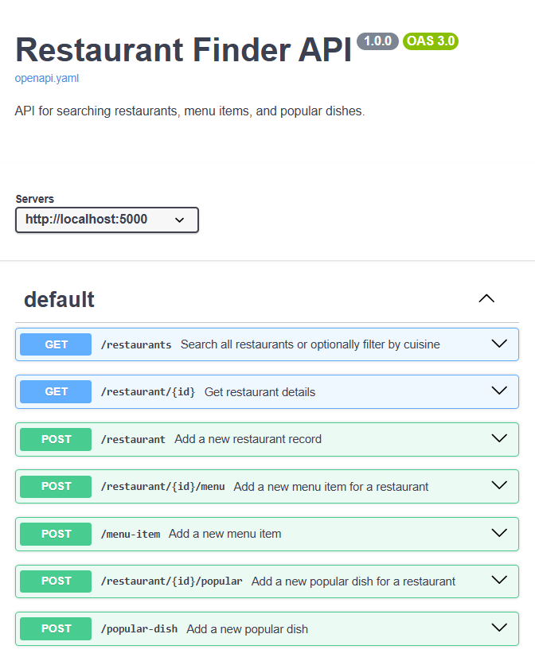

# Restaurants Finder API
RESTful API built with Flask for finding restaurants along with their menus and popular dishes.

## Technology
- Flask
- SQLAlchemy

## Setup Instructions

### 1. Install dependencies
```sh
pip install -r requirements.txt
```

### 2. Run the application
```sh
python run.py
```
The API will be available at `http://127.0.0.1:5000`.

## Documentation

https://chaeng-ploypaphat-s.github.io/restaurants-finder-api/

